# 💳 TeenTech

  <h3>초등학생을 위한 용돈관리 플랫폼</h3>

## 📅 기간

- **2023.08.21 ~ 2023.10.06(7주)**

 

## 🔎 목차

1. <a href="#subject">🎯 기획 배경</a>
1. <a href="#mainContents">⭐️ 주요 기능</a>
1. <a href="#skills">🛠️ 기술 스택</a>
1. <a href="#erd">💾 ERD</a>
1. <a href="#contents">🖥️ 화면 소개</a>
1. <a href="#developers">👥 팀원 소개</a>
1. <a href="#divisionOfDuties">💡 업무 분장</a>

 

## 🎯 기획 배경

1. 우리나라의 청소년 금융 비문맹률은 33%로, 3명중 2명은 금융에 대해서 문맹에 가깝다는 조사 결과.
2. 현재 초등학교 사회 과목에는 금융 내용의 요소가 없다.
3. 직접 용돈을 관리하며 금융 개념을 배우는 체험형 금융 교육 및 관리 플랫폼이 있으면 어떨까?
   

  ## ⭐️ 주요 기능

### 용돈 관리

- 가계부를 작성하고
- 지출 내역을 관리하며 필요소비와 욕구소비에 대한 개념을 익힙니다.

---

### 소득창출

##### 아르바이트
- 부모님이 등록한 미션을 확인, 수행하여 근로 소득 창출

##### 금융 퀴즈
- 다양한 퀴즈 통한 금융 개념 학습

##### 복권
- 경제활동을 성실하게 한다면 뜻밖의 행운이 찾아올지도..?

---

### 투자

##### 예금
- 모의 예금을 통해 단리, 복리의 개념 학습
##### 주식
- 모의 주식을 통해 주식의 흐름과 개념 학습
- 실제 뉴스를 GPT를 통해 초등학생이 이해할 수 있는 문장으로 변환하여 제공

---

### 대출
- 부모님께 부족한 용돈을 요구하여, 왜 필요한지, 어디에 쓸 건지, 작성하며 체계적인 목적과 약속 학습.

---

### 챗봇
1. 

 

## 🛠️ 기술 스택

<!-- -(색깔)?style=for-the-badge&logo=(이름)&logoColor=white>) -->

### 프론트

 

  

 

---

### 백엔드

   
  

---

### 협업

   

 

 

## 💾 ERD

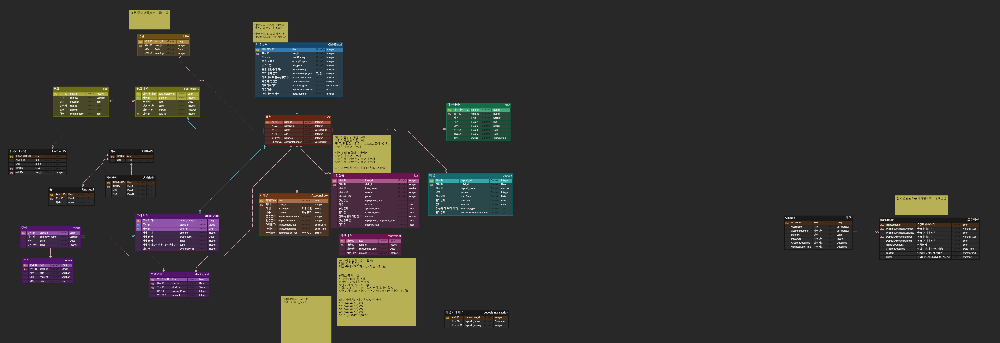

 

## 🖥️ 화면 소개
- 부모용 관리페이지와 자녀용 페이지로 구분됩니다.
 

#### 부모용 페이지
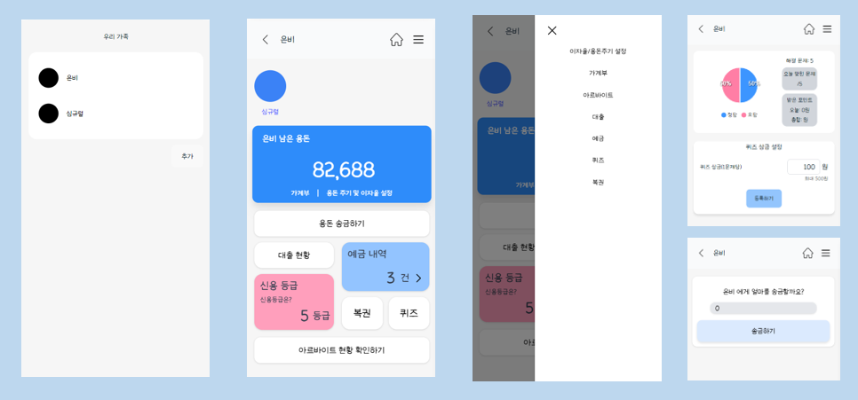
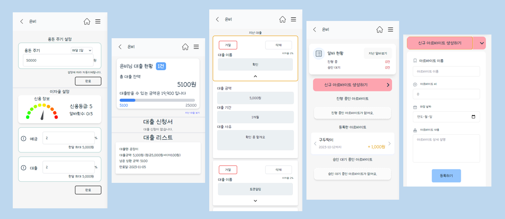
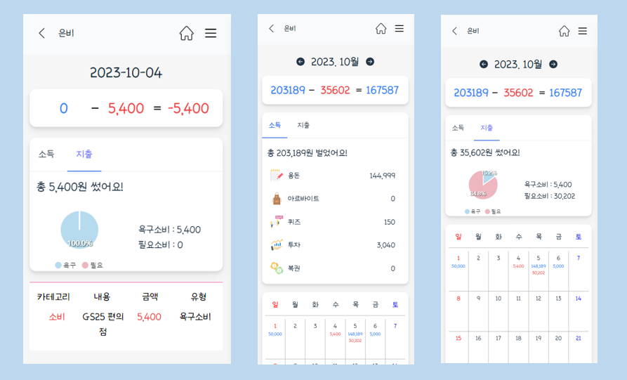

 

#### 자녀용 페이지
##### 1. 메인페이지
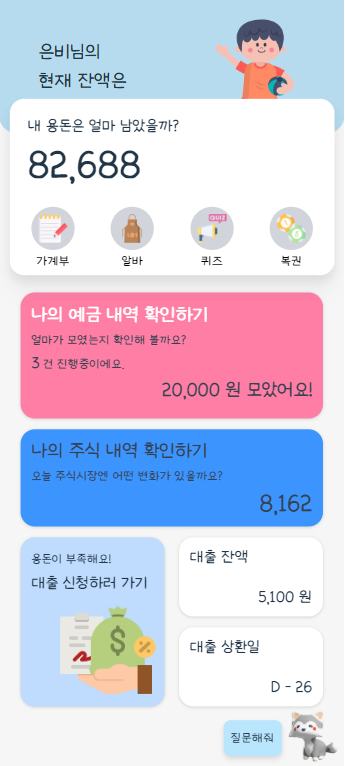
 

##### 2. 자녀 가계부 페이지
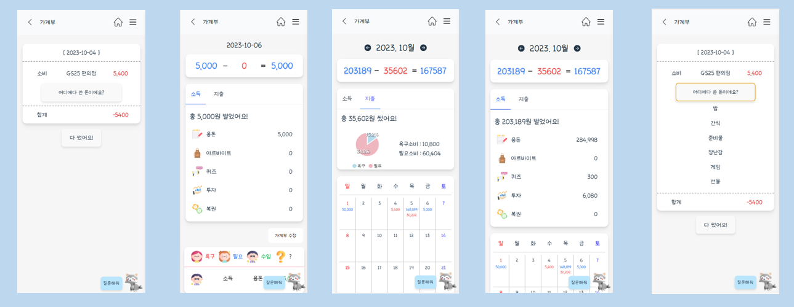
 

##### 3. 자녀 아르바이트 페이지
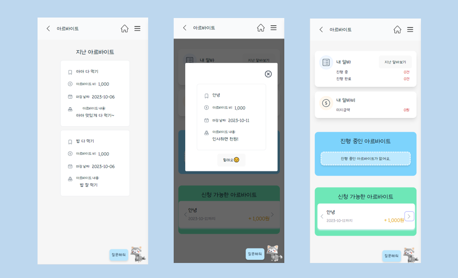
 

##### 4. 자녀 대출 페이지
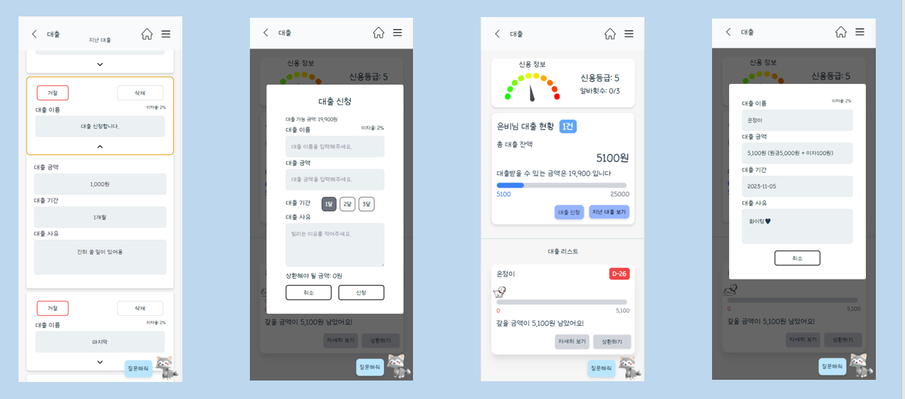
 

##### 5. 자녀 예금 페이지
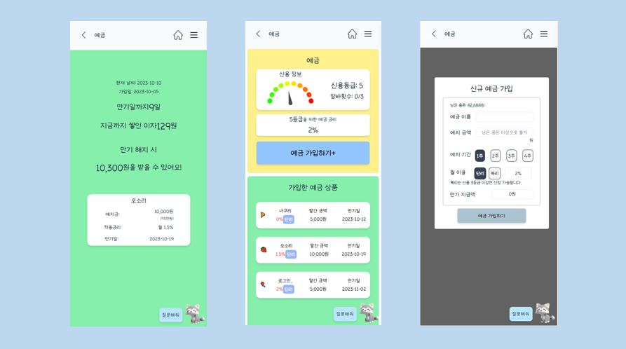
 

##### 6. 자녀 주식 페이지
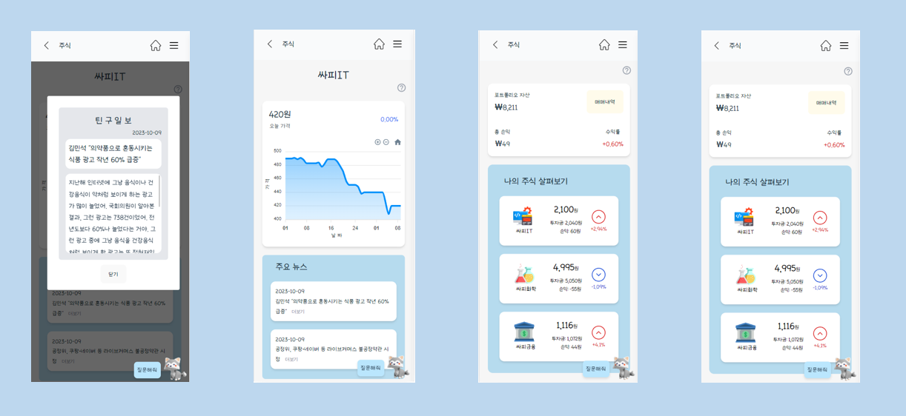
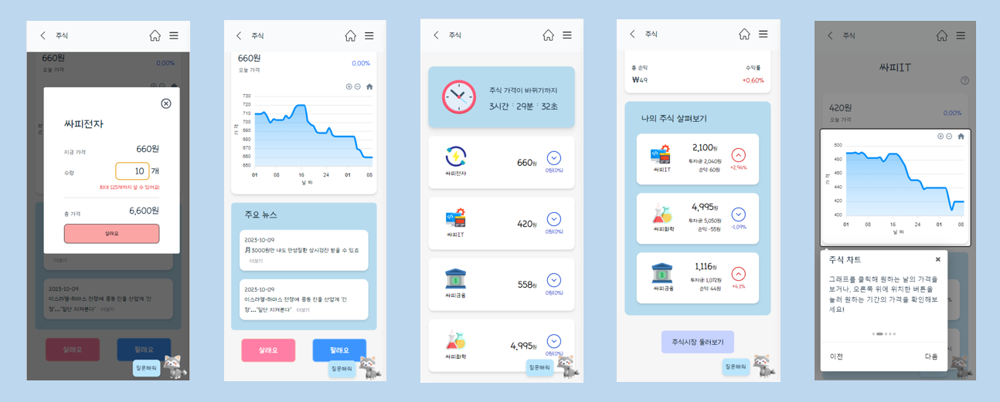
 

##### 7. 자녀 퀴즈 페이지
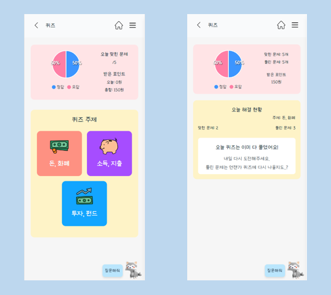
 

##### 8. 자녀 복권 페이지
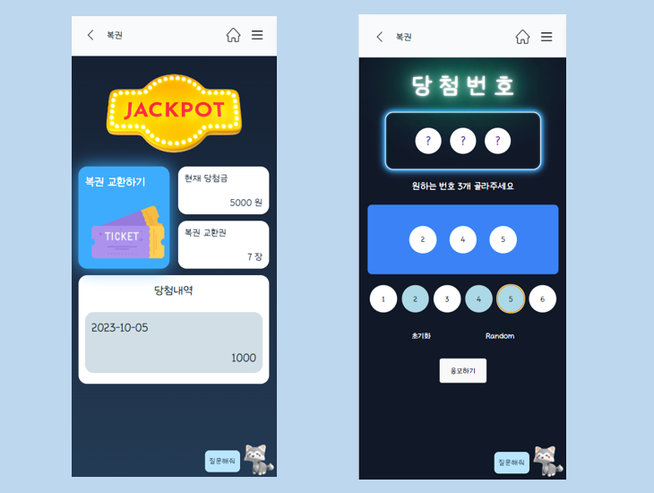
 

##### 9. 자녀 챗봇 페이지

 

 

## 👥 팀원 소개

|   **Name**   |                       권은정                       |                       김은비                       |                       심규렬                       |                       정재범                       |                                      황세진                                       |
| :----------: | :------------------------------------------------: | :------------------------------------------------: | :------------------------------------------------: | :------------------------------------------------: | :-------------------------------------------------------------------------------: | 
| **Profile**  | 권은정 | 김은비 | 심규렬 | 정재범 | 황세진 |
| **Position** | Leader   Frontend | Frontend | Backend | Frontend | Backend |
|   **Git**    |      [GitHub](https://주소)       |     [GitHub](https://주소)       |     [GitHub](https://주소)      |       [GitHub](https://주소)        | [GitHub](https://주소)  |

 

## 💡 업무

#### FrontEnd

- **권은정** : 
- **김은비** : 
- **정재범** : 
   

#### BackEnd

- **심규렬** : 
- **황세진** : 

